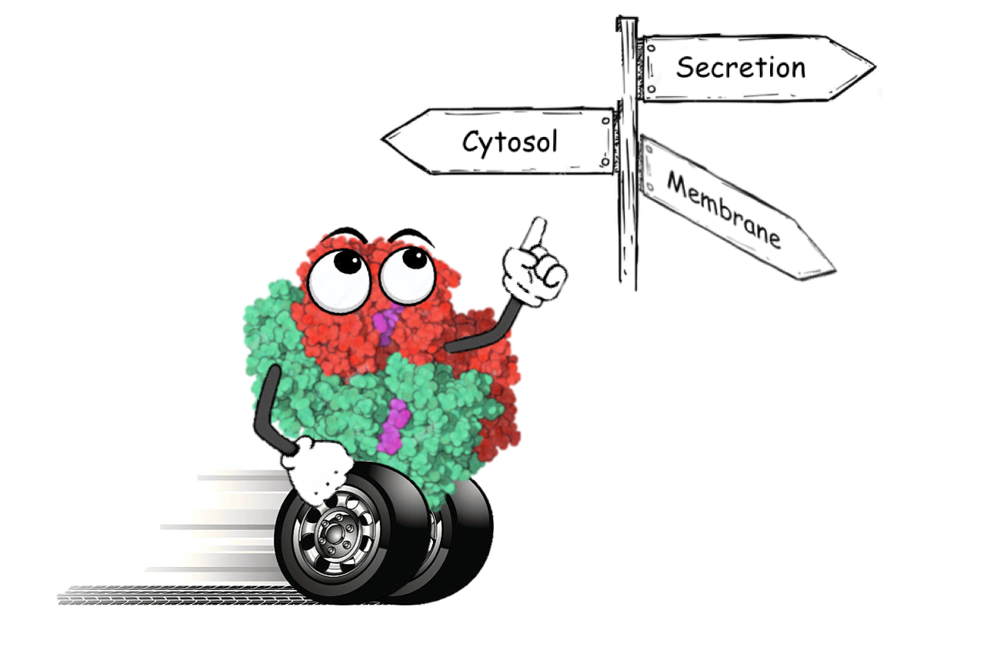

# Lean Mean Protein Machine!

[](https://travis-ci.com/Lean-Mean-Protein-Machine-Learning/LMPM)
[](https://coveralls.io/github/Lean-Mean-Protein-Machine-Learning/LMPM?branch=main)



<!-- TABLE OF CONTENTS -->
<details open="open">
  <summary>Table of Contents</summary>
  <ol>
    <li><a href="#project-overview">Project Overview</a></li>
    <li><a href="#dependencies">Dependencies</a></li>
    <li><a href="#getting-started">Getting Started</a></li>
    <li><a href="#usage">Usage</a></li>
    <li><a href="#license">License</a></li>
    <li><a href="#contact">Contact</a></li>
  </ol>
</details>


<!-- ABOUT THE PROJECT -->
## Project Overview

Structure-based design of proteins shows great promise in nanoparticle vaccines. However, one of the major hurdles to function and use of designed nanoparticles is sub-optimal secretion. In this project, we have analyzed proteins in three different organisms (humans, yeast, and E. Coli) to correlate subcellular location to genetically encodable features. We have also added an option of extending this model to include transmembrane potential, percent of secondary structure helices, and flexibility of amino acids. These models predict the probability of a protein being in the secreted class. We have also added a function to introduce point mutations into a designed protein to improve the secretion score.

## Dependencies
1. [Pandas](https://anaconda.org/anaconda/pandas)
	- Data-organization framework
2. [Numpy](https://anaconda.org/anaconda/numpy)
	- Numerical operations
3. [Scikit-Learn](https://anaconda.org/anaconda/scikit-learn)
    - Supervised machine learning models
4. [Matplotlib](https://anaconda.org/anaconda/matplotlib)
	- Data Visualization in python 
5. [Seaborn](https://anaconda.org/anaconda/seaborn)
	- High-level interface for attractive graphics


<!-- GETTING STARTED -->
## Getting Started


Clone the repository:

  ```sh
  https://github.com/Lean-Mean-Protein-Machine-Learning/LMPM.git
  ```
Move inside the repository:

  ```sh
  cd LMPM
  ```
Install the environment:

  ```sh
  conda env create -f environment_dev.yml
  ```
Load the environment:

  ```sh
  conda activate lmpmdev
  jupyter notebook
  ```
This environment fulfills the requirements of the module:
- python=3.8.8
- numpy=1.20.1
- pandas=1.2.3
- matplotlib=3.3.4
- seaborn=0.11.1
- scikit-learn=0.23.2

The `lmpm` module can be installed using:
```sh
python3 -m pip install git+https://github.com/Lean-Mean-Protein-Machine-Learning/LMPM
```


<!-- USAGE EXAMPLES -->
## Usage

First, import the module:
  ```python
  import lmpm
  ```

Alternatively, the six main functions can be imported individually:
```python
from lmpm import predict_loc_simple
from lmpm import predict_location
from lmpm import optimize_sequence
from lmpm import plot_optimization
from lmpm import top_mutations
```

### Predict protein localization
The localization probability of the protein (according to the model) can be predicted using `predict_loc_simple`. The function needs the user to specify a sequence, the desired organism, and the localization of interest (secreted, membrane, or cytoplasm):
  ```python
  sequence = 'MKPNIIFVLSLLLILEKQAAVMGQKGGSKGRLPSEFSQFPHGQKGQHYSG'
  organism = 'human'
  target_location = 'secreted'
  predicted_class, secretion_score = predict_loc_simple(sequence, organism, target_location, include_dg=False)
  ```
The localization and probabilities of the protein can also be predicted using the more versatile function `predict_location`. This can be expanded to all organisms and returns the results as a class with multiple attributes:
  ```python
  sequence = 'MKPNIIFVLSLLLILEKQAAVMGQKGGSKGRLPSEFSQFPHGQKGQHYSG'
  organism = 'human'
  target_location = 'all'
  predictions = predict_location(sequence, organism, target_location, include_dg=False)
  preds.result
  ```

### Make point mutations in sequence to improve desired localization
Point mutations can be introduced in a sequence to investigate their effects on protein localization. First, the `optimize_sequence` function takes in the sequence, organism, desired localization, and the positions for desired point mutations. Note that only one point mutation occurs at a time. The `mutated_scores` variable below returns a data frame of amino acids vs. the locations for point mutations and the values of the localization scores (as the probability of the protein belonging to the desired localization class).
  ```python
  sequence = 'MKPNIIFVLSLLLILEKQAAVMGQKGGSKGRLPSEFSQFPHGQKGQHYSG'
  organism = 'human'
  target_location = 'cytoplasm'
  positions = '4,9'
  mutated_scores, initial_score = optimize_sequence(sequence, organism, target_location, include_dg=False, positions=positions)
  ```
The outputs of this function can be represented using the `plot_optimization` function. This takes as inputs the results returned by the `optimize_sequence` function:
  ```python
  plot_optimization(mutated_scores, initial_score, plot_inplace=True, dpi=100)
  ```
Finally, the `top_mutations` function takes the results from the `optimize_sequence` function and returns the top mutations that change the localization score. The example below shows the top 10 results from the optimization function:
  ```python
  top_mutations(mutated_scores, initial_score, top_results=10)
  ```
A more informative demo notebook is available under docs/lmpm_demo.ipynb

<!-- LICENSE -->
## License
This project is licensed under the MIT license.


<!-- CONTACT -->
## Contact

- Melissa Ling - mling13@uw.edu Github: mling13
- Marc Exposit - mexposit@uw.edu Github: marcexpositg
- Andrew Favor - afavor@uw.edu Github: andrewfavor95
- Joe Henthorn - JosefH1@uw.edu  GitHub: JoeHenthorn
- Gizem Gokce - gizemg@uw.edu Github: gizemgokce

